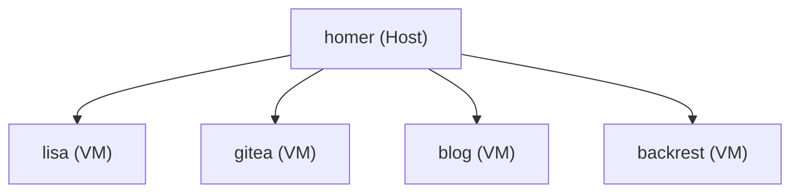

+++
date = '2025-11-20T04:17:21-05:00'
draft = true
title = 'My Homelab Backup Scheme'
toc = true
+++

## Overview

I recently started working on a homelab. Nothing special so far, just an old 2012 Mac Mini and a couple of external drives. I'm looking to expand soon. It's a basic host/VM setup, using [libvirt](https://libvirt.org/) to manage virtual machines.

This is the basic layout:



It's not important what the VMs contain.



I wanted a way to back up the VMs without a lot of work. I came up with a combination of a bash script and some systemd unit files to take snapshots of the VMs and then used Backrest/Restic to upload those backups to Backblaze B2 storage. Let's take a look!

## Local backups

### The Bash script

This script backs up a single VM, dumping its libvirt XML and using that to find any disks associated with the VM. It will only keep the last backup, deleting any others.

This backs the files up to `/mnt/backup/`, which is an external HDD.

```bash
#!/usr/bin/env bash
# We expect this to run as root, otherwise
# virsh will fail to find VMs (domains in libvirt lingo)

set -euo pipefail

# Usage: backup_vm.sh VMNAME
VM="$1"
BASE_DIR="/mnt/backup/vms"
TIMESTAMP=$(date +"%Y-%m-%d_%H-%M-%S")
BACKUP_DIR="$BASE_DIR/${VM}_${TIMESTAMP}"

mkdir -p "$BACKUP_DIR"

echo "Shutting down VM: $VM"
virsh shutdown "$VM"

# Shutting down the VM can take a few seconds
echo "Waiting for VM to stop..."
while true; do
    state=$(virsh domstate "$VM" 2>/dev/null | tr 'A-Z' 'a-z')
    if [[ "$state" =~ (shut[- ]?off|off) ]]; then
        echo "VM is off."
        break
    fi
    sleep 2
done

echo "Dumping XML config..."
virsh dumpxml "$VM" > "$BACKUP_DIR/${VM}.xml"

echo "Backing up disks..."

# This is using XPath to find the disks associated with the VM
# mapfile turns that list of disks into an array
# Assumes that the disks have a physical filesystem mapping
mapfile -t disks < <(virsh dumpxml "$VM" | xmlstarlet sel -t -v "//disk[@device='disk']/source/@file" -n)

# loop through the disks and 
for disk in "${disks[@]}"; do
    base=$(basename "$disk")
    temp_copy="$BACKUP_DIR/${base}"

    echo "Copying $disk → $temp_copy"
    cp --reflink=auto --sparse=always "$disk" "$temp_copy"

    # Using -6 as a compromise between time and compression level
    # This is Good Enough™ because the disk images are sparse anyway
    echo "Compressing disk image with zstd..."
    zstd -T0 -6 "$temp_copy"
    rm "$temp_copy"  # leave only .zst
done

echo "Restarting VM..."
virsh start "$VM"

echo "Backup complete: $BACKUP_DIR"

echo "Cleaning old backups (keeping only most recent)..."

# Find all backup directories for this VM in $BASE_DIR
mapfile -t old_backups < <(
    ls -1dt "$BASE_DIR"/"${VM}"_* 2>/dev/null | tail -n +2
)

# Delete all but the newest
for backup in "${old_backups[@]}"; do
    echo "Deleting old backup: $backup"
    rm -rf "$backup"
done

```

### The serviced unit file

Because we call this `backup-vm@.service`, we can register this as `backup-vm@my-vm-name`. `my-vm-name` becomes the parameter for the unit file (`%i`), which then gets passed to the bash script as `$1`.

```ini
[Unit]
Description=Backup libvirt VM %i
After=network-online.target libvirtd.service
Wants=network-online.target

[Service]
Type=oneshot
ExecStart=/usr/local/bin/backup-vm.sh %i
Nice=10
IOSchedulingClass=best-effort
IOSchedulingPriority=7
```

### The serviced timer file

Systemd timers are a nicer way to do cron jobs. The unit file below sets up a timer that will execute at midnight, firing off the oneshot service we defined above.

```ini
[Unit]
Description=Daily backup for VM %i

[Timer]
OnCalendar=daily
Persistent=true

[Install]
WantedBy=timers.target
```

## Putting the local backups together

To set this all up, these are the steps I took:

```bash
# Copy script
sudo cp backup-vm.sh /usr/local/bin/backup-vm.sh

# Copy unit file for service
sudo cp backup-vm@.service /etc/systemd/system/backup-vm@.service

# Copy unit file for timer
sudo cp backup-vm@.timer /etc/systemd/system/backup-vm@.timer
```

Next, we have to reload systemd so it will pick up the changes:

```bash
sudo systemctl daemon-reload
```

Then for each VM, I enable a timer:

```bash
# Test once
sudo systemctl start backup-vm@myvm

# Enable timer for VM
sudo systemctl enable --now backup-vm@myvm.timer

# Check the timers
systemctl list-timers | grep backup-vm
```

## Remote backups

I then want to follow the [3-2-1 backup rule](https://en.wikipedia.org/wiki/Backup#3-2-1_Backup_Rule). This is basically that you should have **3** copies of the data, **2** local (the live data and a backup) and **1** remote copy.

I'm using [Backblaze B2](https://www.backblaze.com/cloud-storage), an S3-compatible cloud storage solution. I chose this because it offers a generous (10GB) free tier and is cheaper above that than most other similar providers. Since my backup images are compressed using zstd, they average about 4.5-5.0 GB total.

To manage the remote backup process, I'm using [Backrest](https://garethgeorge.github.io/backrest/), a UI and orchestrator for [Restic](https://restic.net/) backup software. Installing these is beyond the scope of this post, though I'll probably detail my setup in more detail later.

I personally think using Backrest as a web UI on top of Restic is overkill since I only have 1 backup plan, but it was easy to setup and I might use it for more detailed scenarios later.

### Repos and Plans in Backrest

Backrest has the concept of _repos_ and _plans_.

A repo is simply a configuration of where to put some backups.

Restic repo configs are expressed in JSON, though there is a nice GUI in backrest for them. Here's my settings for my `vm-backups` repo below. Note that since Backblaze B2 is S3-compatible, we use the S3 upload feature. There is a specific B2 feature, but the Restic folks recommend using the S3 adapter.

```jsonc
{
  "id": "vm-backups",
  "guid": "{some_guid_assigned_by_backrest}",
  "uri": "s3:https://s3.us-east.backblazeb2.com/{bucket_name}",
  "password": "{encryption_password}",
  "env": [
    "AWS_ACCESS_KEY_ID={backblaze_access_key}",
    "AWS_SECRET_ACCESS_KEY={backblaze_secret_id}"
  ],
  "flags": [],
  // A prune policy is how often restic will prune the repo.
  // I set B2 up to only keep one version of the files,
  // so this is basically moot.
  "prunePolicy": {
    "maxUnusedPercent": 10,
    "schedule": {
      "clock": "CLOCK_LAST_RUN_TIME",
      "maxFrequencyDays": 2
    }
  },
  // Restic can occasionally check the files in the repo for
  // integrity. This is the schedule for which to do so.
  "checkPolicy": {
    "readDataSubsetPercent": 0,
    "schedule": {
      "clock": "CLOCK_LAST_RUN_TIME",
      "maxFrequencyDays": 2
    }
  },
  "commandPrefix": {
    "ioNice": "IO_DEFAULT",
    "cpuNice": "CPU_DEFAULT"
  },
  "autoUnlock": false,
  "hooks": []
}
```

A plan is the actual execution of the backup. What I want to do is to take the files generated by my backup script and put them in the repo. Here's my config for that. Notice it references the repo configured above. Backrest itself is on a guest VM on the host where the external drive is mounted. I set up the VM to share `/mnt/backup` on the host and mount that at `/mnt/backup` on the guest.

```jsonc
{
  "id": "vm-backup",
  "repo": "vm-backups",
  "paths": [
    "/mnt/backup/vms"
  ],
  "excludes": [],
  "iexcludes": [],
  // The local backups run at 00:00.
  // This will run at 02:00.
  "schedule": {
    "clock": "CLOCK_LOCAL",
    "cron": "0 2 * * *"
  },
  "backup_flags": [],
  "hooks": [],
  "retention": {
    "policyKeepAll": true
  }
}
```

## TODO / Next Steps

1. The external drive currently goes to sleep after a certain amount of inactivity (I think 6hrs), so every evening I have to remount it in both the host and backrest VM before I go to bed. There's a way to make it not do this, I just haven't had the chance to look into it further.
2. I want to see if I can use Backrest/Restic to do the local part as well.
3. I need to eventually move to an actual NAS to do backups. I've been eyeing [this nice one](https://store.45homelab.com/configure/hl4) from 45Drives, but that's $$$ and I only have $$.